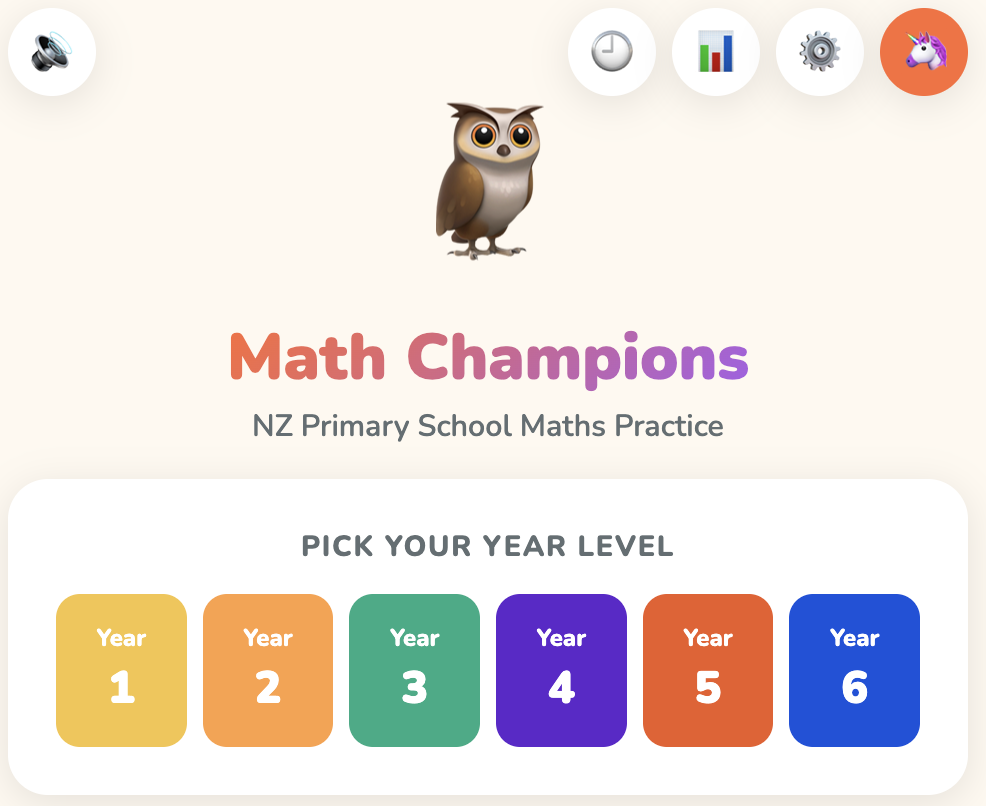
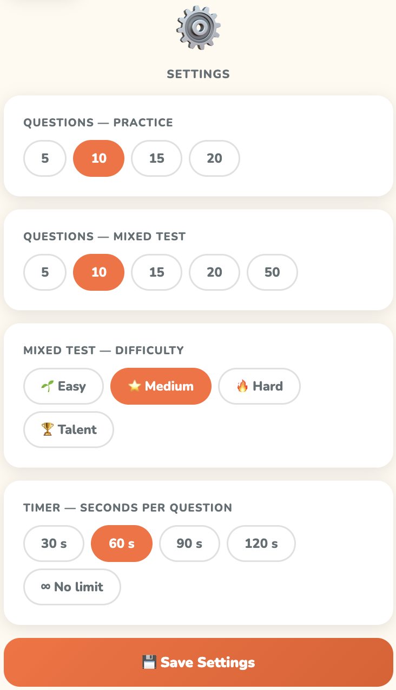
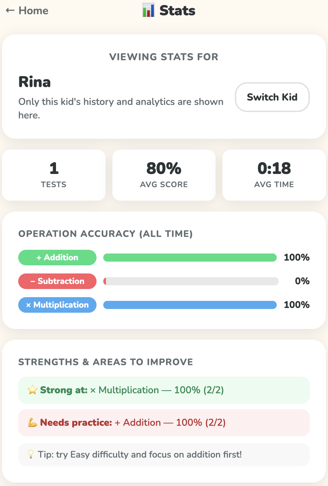

# Math Champions 🦉

A browser-based maths practice app for New Zealand primary school children (Year 2–6).
No installation. No sign-up. Just open and play.

<p align="center">
  
</p>

An engaging, touch-friendly maths app with cheerful visuals, year-based levels, and quick practice sessions for young learners.

## Try It Online

Live demo: [https://vietha.github.io/Kid-Learning-Math-App/index.html](https://vietha.github.io/Kid-Learning-Math-App/index.html)

---

## App Preview

<p align="center">
  
  
  
</p>

From kid login and year-level selection to settings, score tracking, and per-kid analytics, the app is designed to feel simple, cheerful, and easy to use on tablets and phones.

---

## Quick Start

1. Download or clone this folder to your computer
2. Open **`index.html`** in any modern web browser (Chrome, Firefox, Safari, Edge)
3. Pick a year level and start practising!

> **Works completely offline.** No internet connection required after the first page load
> (Google Fonts will load if online, and fall back to a system font if offline).

---

## Features

| Feature | Details |
|---|---|
| 5 year levels | Year 2–6, aligned to the NZ primary school curriculum |
| Practice Mode | Focus on one operation at a time |
| Mixed Test Mode | All operations shuffled together |
| Optional timer | 60-second countdown per question (toggle on/off) |
| Instant feedback | Animations and sounds after every answer (Practice only) |
| Star ratings | 1–3 stars based on your score |
| Confetti | Launched automatically for a 3-star result |
| Multi-kid mode | Simple name + age login for separate kid profiles |
| Best scores | Saved in your browser for each kid separately |
| History & analytics | Per-kid test history, recent trends, and operation accuracy |
| Touch-friendly | Large numpad buttons — great on tablets and phones |
| Keyboard support | Type numbers + press Enter on desktop |

---

## NZ Curriculum Alignment

| Year | Age | Numbers up to | Operations |
|---|---|---|---|
| Year 2 | 6–7  | 20      | + − |
| Year 3 | 7–8  | 100     | + − × (intro) |
| Year 4 | 8–9  | 100     | + − × ÷ |
| Year 5 | 9–10 | 1,000   | + − × ÷ |
| Year 6 | 10–11| 10,000  | + − × ÷ |

### Question rules
- Answers are always non-negative whole numbers (no negatives)
- Division always divides evenly — no remainders
- Numbers stay within the year-level range at all times
- No repeated questions within a single session

---

## How to Play

### Home screen (`index.html`)
1. Log in as a kid using name + age
2. Tap a year level
3. Choose **Practice** or **Mixed Test**

### Login screen (`login.html`)
- Add a kid with a name and age
- Tap a kid card to log in
- Each kid gets separate settings, best scores, and analytics

### Practice Mode (`practice.html`)
- Pick one operation: + − × ÷
- Answer 10 questions one at a time
- See instant feedback (correct/wrong) after each answer
- Encouraging messages keep you going!
- Your score and stars appear at the end

### Mixed Test Mode (`test.html`)
- All available operations are mixed together
- Answer 10 questions with no mid-test feedback
- Toggle the ⏱ timer on or off before you start
- See your results at the end

### Results Screen (`results.html`)
- ⭐ 1–3 stars based on your percentage
- 🎉 Confetti for 80 %+ (3 stars)
- Hit **Try Again** to replay the same mode, or **Go Home** to switch

### History & Stats (`history.html`)
- View test history for the current kid
- See average score, average time, and recent results
- Track strongest and weakest operations over time

---

## File Structure

```
Kid-Learning-Math-App/
├── login.html        ← Kid login and profile selection
├── index.html        ← Home screen (name entry, year & mode selector)
├── practice.html     ← Single-operation practice (instant feedback)
├── test.html         ← Mixed test with optional timer
├── results.html      ← Score, stars, confetti, navigation
├── history.html      ← Per-kid history and analytics dashboard
├── images/           ← README screenshots and preview assets
├── style.css         ← Shared design system
├── app.js            ← Question engine, timer, audio, localStorage
└── project-plan.md   ← Original project specification
```

---

## Development

No build tools, no npm, no frameworks — just open the HTML files directly.

**Recommended for development** — run a local server to avoid browser file-access restrictions:

```bash
# Python 3
python3 -m http.server 8080

# Node.js (npx)
npx serve .
```

Then open `http://localhost:8080` in your browser.

---

## Browser Support

Chrome, Firefox, Safari, Edge — all modern versions.
Audio uses the Web Audio API (silently skipped if not available).
